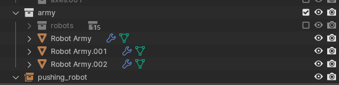
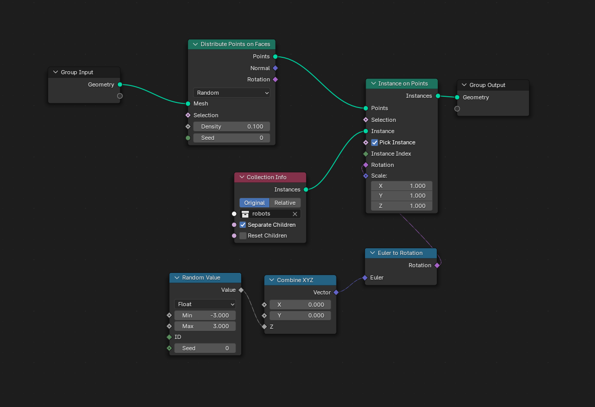

# Visualization


This page will walk you through how to generate Blender renders from IsaacGym rollouts, as shown above (more examples on our [website](https://umi-on-legs.github.io/)).
I'll assume you are familiar with Blender basics.

## Overview

*Steps*:
 - 1. Run a policy rollout
```sh
python scripts/play.py --ckpt_path /path/to/model.ckpt --device cuda:0 --num_steps 1000 --num_envs 1  --visualize
```
 - 2. Get the `logs.pkl` pickle file in the rollout run's directory, and paste its path to `pickle_path` in `scripts/import_blender.py`.
 - 3. Download the [starter Blender scene](https://www.cs.columbia.edu/~huy/assets/umi_on_legs.blend) then open it.
 - 4. In the scripts panel in Blender, press `[ALT]+R` to reload `import_blender.py` with the new `pickle_path`. If blender says it's not found, you change the script's path to your script's path.
 - 5. In the scripts panel in Blender, press `[ALT]+P` to run the script. This will import the IsaacGym simulation into Blender.

*Explanation*:
My rendering pipeline starts with a policy rollout completely in IsaacGym (`scripts/play.py`), where I'll save the simulation states at all timesteps and dump it into a pickle file (`/path/to/run/dir/logs.pkl`).
The second step involves setting up all the lighting, materials, meshes, link names inside a Blender (this part requires the most Blender wizardry, but you can download my Go2ARX5 Blender file from [here](https://www.cs.columbia.edu/~huy/assets/umi_on_legs.blend)).
The third step involves looping through all timestep's states, then keyframing the corresponding links in Blender. 

## Visualizing Target Poses

Target poses are rendered as Freestyle lines in Blender. However, they make rendering much slower by introducing a CPU-only visibility computation phase. If you don't need to visualize target poses with Freestyle lines, you can scroll to the bottom right, and untick Freestyle


## Rendering an Army of Robots

To efficiently render a large number of robots, you'll want to use instancing, so that rendering data (mesh, animation, etc.) can be shared across many robots.
In the robot army animation on the project's website, I've just taken one policy, rolled it out for a 10000 steps, created 14 different copies of this animation in Blender with slightly offsetted times.
You can visualize this army if you tick the `army` collection to enable it.



At the heart of this army is a geometry node setup, which implements this instancing.
The geometry node setup takes as input a mesh (e.g., `Robot Army` is just a plane), then distributes randomly rotated robot instances on the mesh, sampled from the `robots` collection.




> 💡 **Protip**
> 
> Rendering takes a lot of time. I recommend installing Blender on your servers, then doing all the rendering there.
> I usually parallelize different frames over different servers, with the command below:
> ```sh
> for x in $(seq 0 100 400); do echo $x; done | xargs -P 5 -l zsh -c 'CUDA_VISIBLE_DEVICES=2,3 blender -noaudio --background umi_on_legs.blend --render-output outputs/ --engine CYCLES --render-format JPEG --frame-start $0 --frame-end $(($0+100)) --render-anim -- --cycles-device CUDA'
> ```
> Running this command will:
>  - Partition frames 0 to 500 into chunks of 100 frames, giving 5 parallel processes.
>  - CUDA_VISIBLE_DEVICES to limit usage to only certain GPUs, so you get fast rendering speeds without losing friends in your lab.
>  - `-background` will launch Blender headless. `-noaudio` helps since many servers don't have a display manager that manages audio devices.
>  - `umi_on_legs.blend` tells Blender which file to open. This should be the Blender file you've already imported your simulation into.
>  - `--render-output outputs` sets the output path to a directory. Make sure it already exists.
>  - `--render-format JPEG` outputs JPEGs, but you can use PNG if you have strong feelings about transparency.
>  - `--frame-start $0 --frame-end $(($0+100)) --render-anim` renders the animation in chunks of 100 frames.
>  - `-- --cycles-device CUDA` sets the correct rendering device.
> 