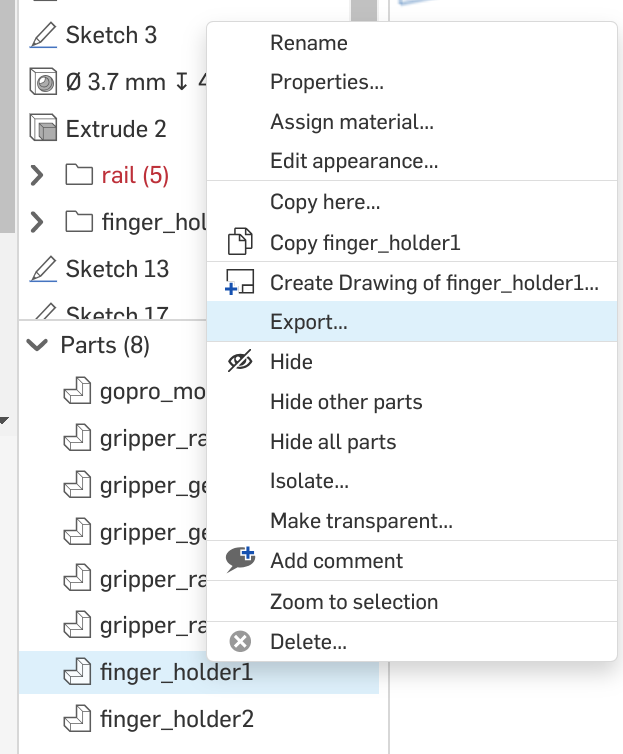
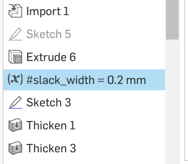

# 3D Printing Guide

Our system consists of 4 major components: Go2 robot dog, Arx5 robot arm, iphone and GoPro. To assemble them, we designed and 3d-printed the connecting parts using common printing materials. We use Ender S3 printer and the same configuration as [UMI](https://docs.google.com/document/d/1TPYwV9sNVPAi0ZlAupDMkXZ4CA1hsZx7YDMSmcEy6EU/edit).

To download these CAD models, after selecting the part in the web GUI, you can find the highlighted part name in the `Parts` panel on the left. Right lick the highlighted part and then you can export it to `STL` files.

- [Fin-ray gripper finger](https://cad.onshape.com/documents/df1d9ecd7ddd1fab68647ec9/w/957233b8e11f5cf8c592f75b/e/2b7aa35d19c6bcb9562f4922)(TPU). To print this part, please follow the [UMI tutorial](https://docs.google.com/document/d/1TPYwV9sNVPAi0ZlAupDMkXZ4CA1hsZx7YDMSmcEy6EU/edit) for detailed printing instructions.

- GoPro mount for Arx5 robot arm: The black piece in the [CAD Model](https://cad.onshape.com/documents/df1d9ecd7ddd1fab68647ec9/w/957233b8e11f5cf8c592f75b/e/c307fd00a1f4677c33022436?renderMode=0&uiState=668eecc9c7235b22094fc1fc). Material: PA6-CF Carbon Fibre Reinforced Nylon. To print this part, please follow the [UMI tutorial](https://docs.google.com/document/d/1TPYwV9sNVPAi0ZlAupDMkXZ4CA1hsZx7YDMSmcEy6EU/edit) for detailed printing instructions. Please generate **regular support** otherwise the model may collapse when printing.

- Fin-ray finger holder (PLA): The two yellow pieces piece in the [CAD Model](https://cad.onshape.com/documents/df1d9ecd7ddd1fab68647ec9/w/957233b8e11f5cf8c592f75b/e/c307fd00a1f4677c33022436?renderMode=0&uiState=668eecc9c7235b22094fc1fc). Please add **tree support** when slicing. You can rotate the model 90 degree so that the side face points down.

- Go2-Arx5 mount (PLA): [CAD Model](https://cad.onshape.com/documents/871e34dff99a08f156ada60c/w/69c70cd7dba620ca310bb3c1/e/4207c73e769cc874ee5dbfb5?renderMode=0&uiState=668f49212d96c14d2f959d43). When slicing, please rotate the model so that the flat surface faces down.

- Go2-iPhone mount base (PLA): [CAD Model](https://cad.onshape.com/documents/871e34dff99a08f156ada60c/w/69c70cd7dba620ca310bb3c1/e/4207c73e769cc874ee5dbfb5)
- iPhone 15 Pro Case (PLA): [60 Degree](https://cad.onshape.com/documents/608f4646b71c1cbc692bc4ff/w/8446eec6f1c8816677522e5e/e/47dc016736c86060c41a6256); [90 Degree](https://cad.onshape.com/documents/4f575e5e28e95b72fe181970/w/51d35653b27ed534f6a4fdc9/e/5ba4a1359ba1b1d4b7d5894d). **60 Degree Mount** is recommended for a camera view with more visual features and is the default pose transform in the real world codebase. Please add **tree support** when slicing. Note: Due to precision difference of different 3D printers, the iPhone case may not perfectly fit the iPhone. You can make a copy of the CAD model and adjust parameter `slack_width` in the model file, which changes the space between the case and an iPhone model.

