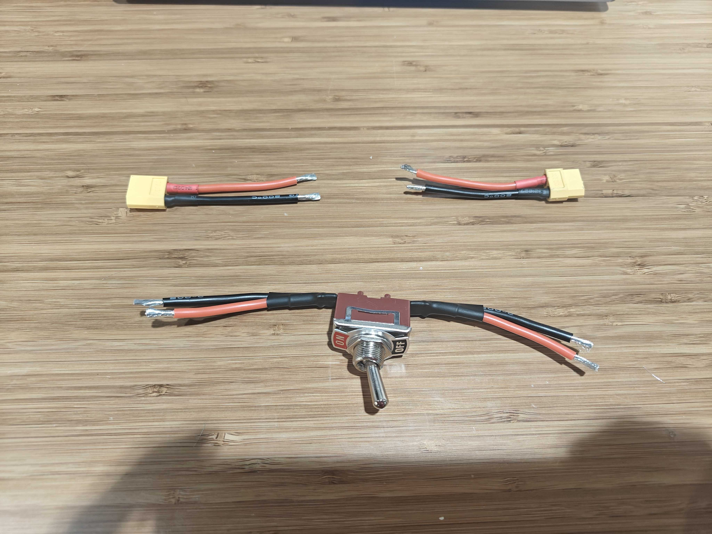
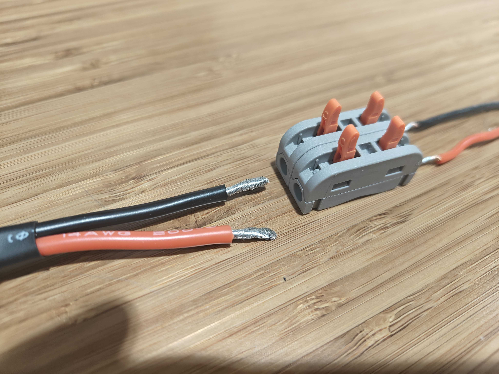
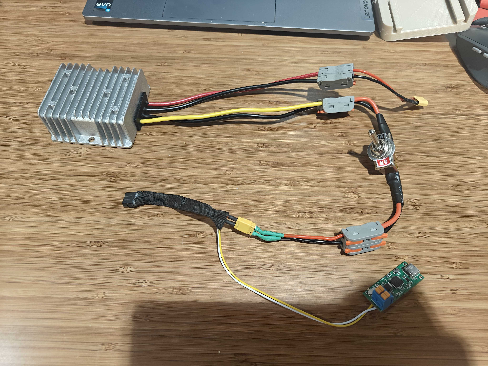

# Assembly Guide

We provide a step-by-step guide to setup the entire UMI-on-Legs system. While assembling the components, please make sure that the dog is laying on the ground and the power supply is cut off.

## UMI Customization for ARX5

In general, fin-ray gripper provides a long grasping range and good compliance so it is widely used in a number of projects. We customize the ARX5 gripper to match the hardware configuration in UMI.

1. Carefully unscrew the gear rack with the original fingers and detach the slider block with the original finger. Make sure the ball bearings do not fall out of the slide block.
2. Use 10mm M3 screws (4 screws on each side) to attach the 3D-printed finger holder to the slider block. 
3. Use 35mm M3 screws (3 screws on each side) to put the fin-ray fingers into their holders.
4. Slide the finger into the rail and put back the gear rack. If the gear rack cannot mesh well with the central gear, you can put a few washes between the gear rack and the finger holder. Use 14 mm M3 screws (2 screws on each side) to connect the gear rack with the finger.
5. Use two 40mm (or 35mm) m3 screws and one 10mm screw to fix the GoPro mount to the gripper motor.
6. Put on the GoPro media mod and fix it to the mount.

## Power Supply for ARX5

We use Go2's battery to power ARX5 through the XT30 port on the unitree jetson (there are two ports named `BAT`, one is connected to the battery, and we connect the other to ARX5). However, since the fully charged battery is above 32V, while ARX5 only accepts DC input lower than 30V, you need to connect the power output of the battery to a DC adapter module first which provides 24V DC output.

First cut off the two XT60 ports from the switch and strip the wires (keep the XT60 ports and it will be used later). Then you can use these wire connectors to connect all the components together with the following order: XT30 female port -> voltage converter input port (red+ and black-) -> voltage converter output port (yellow+ and black-) -> switch -> XT30 male port -> ARX5 robot arm input cable. 

Before connecting it to the dog, you can first test this long cable using the power supply provided by ARX5, in case any connection is wrong and burns the system.

  
  
  

## Mount ARX5 on Go2

1. Put 3 layers of sponge tape to the trapezoidal depression of the mounting board, which will be against the bump on Go2's head.
2. Use 10mm M3 screws to fix the 3D-printed mounting board to the base of the robot arm. In our project, we use the screw holes that are closest to the trapezoidal depression on the board. Before fixing them, check the bottom joint orientation of ARX5 and make sure the home pose is aligned to the depression. The base joint should be able to rotate 180 degree to one side and ~120 degree to the other side.
3. Unscrew the belt and plug USBC extension cable (for the capture card) and the voltage adapter (XT30 port) to the inner side of the Unitree Jetson module.
4. Slide the mounting board into the rail on the Jetson. Use #TODO M3 screws to fix it to Go2's head.
5. Connect the power cable to ARX5 and the USB cable to the USB-CAN adapter.

## Mount iPhone on Go2
1. After 3d-printing the iPhone case, first check whether it fits an iPhone 15 Pro. It may not fit because of different 3d printer precisions. You may adjust the `slack_width` in the CAD model for better fit.
2. Align all the holes of the iphone case with the base mount and put M3 nuts into the top 4 holes. Use 10mm M3 screws to connect the two pieces.
3. Slide the base into the rail on the Jetson module. Use 20mm M3 screws to fix it to the holes where the belt used to attach.

## Connect Other Peripherals to Go2
1. Connect a USB3.0 extension dock to the Jetson module, and then connect the spacemouse (wireless adapter), wifi module and the USB cable for ARX5 to the extension dock. 
2. For the GoPro power supply, we realized that the USB port cannot provide enough power, so we used the 5V output port on the Jetson. Use the wire connector to assemble an XT30(female)-XT60(female) cable and then use the XT60-USB cable to power the GoPro.
3. Connect the HDMI output of the GoPro to the Elgato capture card and then to the USB-C cable which connects to Jetson.

